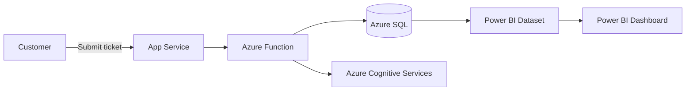

# Automated Customer Support System
  
**Outcome:** Faster triage and reporting, SLA adherence, and measurable insights for support operations.

## Business Context
Customer support needed faster case triage, reliable SLA tracking, and executive visibility. The goal was to define clear requirements, map current and future processes, and deliver a scalable analytics layer and basic service automation on Azure.

## Highlights
- BRD, Epics and User Stories with Gherkin acceptance criteria
- As‑Is and To‑Be process maps, data‑flow and context diagrams
- Non‑functional requirements covering latency, refresh cadence, data quality, and PII
- Azure Functions + Azure SQL + Cognitive Services architecture (sample stub in `src/azure/function_example`)
- Power BI dashboard for case volume, SLA attainment, CSAT (placeholder structure in `src/powerbi`)
- RTM, UAT plan, and test cases

## Repository Structure
```
automated-customer-support-system/
├─ README.md
├─ .gitignore
├─ docs/
│  ├─ BRD.md
│  ├─ UserStories.md
│  ├─ NFRs.md
│  ├─ SecurityPII.md
│  ├─ RTM.xlsx
│  ├─ Process/
│  │  ├─ AsIs.md
│  │  ├─ ToBe.md
│  │  └─ DataFlow.md
│  └─ UAT/
│     ├─ UAT_Plan.md
│     └─ TestCases.xlsx
└─ src/
   ├─ azure/
   │  └─ function_example/
   │     ├─ __init__.py
   │     └─ function.json
   └─ powerbi/
      └─ README.md
```

## How to Review in 2 Minutes
1. Read `docs/BRD.md` then skim `docs/UserStories.md`.  
2. View `docs/Process/*` for As‑Is, To‑Be, and Data‑Flow (Mermaid diagrams render on GitHub).  
3. Check `docs/NFRs.md` and `docs/SecurityPII.md`.  
4. Open `docs/RTM.xlsx` and `docs/UAT/UAT_Plan.md`.  
5. Peek at `src/azure/function_example` and `src/powerbi/README.md`.

## Architecture (Mermaid)


*All data is sample or redacted. Replace placeholders with sanitized artifacts before making the repository public.*
