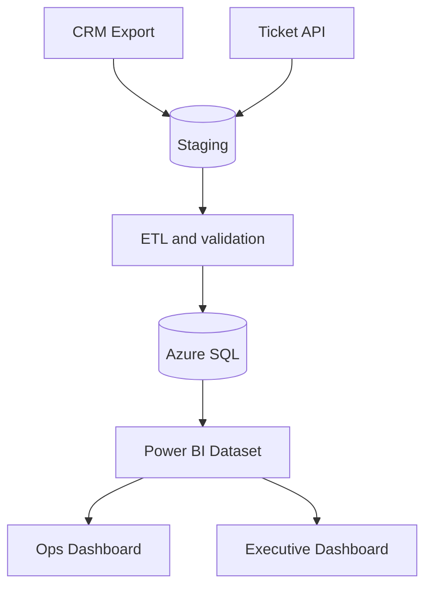

# Data-Flow and Context

```mermaid
flowchart TB
  CRM[CRM Export] --> Staging[(Staging)]
  TicketsAPI[Ticket API] --> Staging
  Staging --> Transform[ETL and validation]
  Transform --> AzureSQL[(Azure SQL)]
  AzureSQL --> PBI[Power BI Dataset]
  PBI --> OpsDash[Ops Dashboard]
  PBI --> ExecDash[Executive Dashboard]
```
