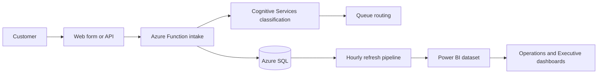

# To-Be Process

```mermaid
flowchart LR
  Customer --> App[Web form or API]
  App --> Function[Azure Function intake]
  Function --> SQL[(Azure SQL)]
  Function --> Classifier[Cognitive Services classification]
  Classifier --> Router[Queue routing]
  SQL --> Refresh[Hourly refresh pipeline]
  Refresh --> PowerBI[Power BI dataset]
  PowerBI --> Dashboard[Operations and Executive dashboards]
```
